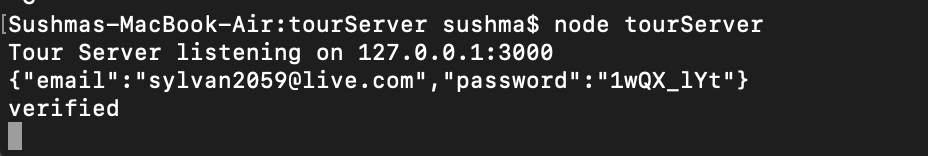
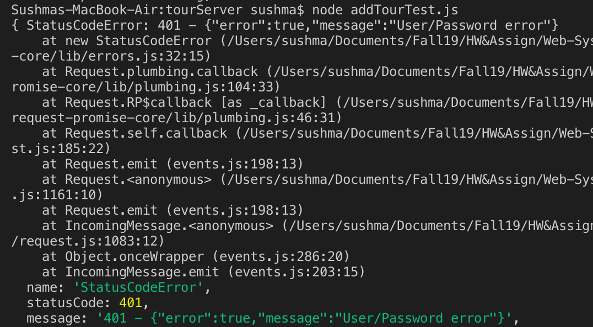
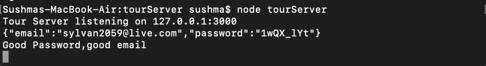
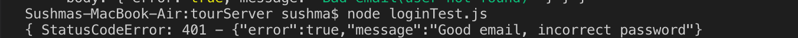
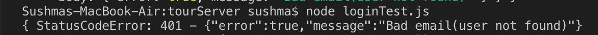

**Student Name**:  Sushma Cheneerkuppum Sreedharan

**NetID**: rg4984

# Homework #8 Solution

## Question 1 

### (a)

"Confidentiality refers to protecting information from being accessed by unauthorized parties. Only the people who are authorized to do so can gain access to sensitive data."

**Recent data breach**

"Buca di Beppo's parent company, Earl Enterprises, was hit with a major data breach that potentially lasted from May 23, 2018 to March 18, 2019. The breach may have exposed customers' names and credit- and debit-card numbers, as well as their expiration dates."

Another name for loss of confidentiality: **breach**

### (b)

It's important to check the integrity of a software/file when we download it from the internet to insure that we don't accidentally download malware, viruses etc.

### (c)

i. "DoS  (Denial of Service attacks): DOS Attack is a type of attack to a network server  with large number or service requests with it cannot handle. DoS (Denial of Service Attack) can causes the server to crash the server and legitimate users are denied the service."

ii. Yes, WiFi jammers would be an attack on availability.

## Question 2

### (a)

i. "Credential stuffing is a type of cyberattack where stolen account credentials typically consisting of lists of usernames and/or email addresses and the corresponding passwords (often from a data breach) are used to gain unauthorized access to user accounts through large-scale automated login requests directed against a web application."

Users should not use the same password because of credential stuffing and data breach.
"There are often data breaches where companies have not stored data such as usernames and passwords securely. This data becomes public knowledge, and it could contain your username and password for certain sites."

"When this type of data becomes available, hackers and cybercriminals perform credential stuffing attacks, using stolen usernames and passwords to attempt to log into various other accounts like banking accounts."

One of my email(sushmacs15@gmail.com) is associated with one data breach through Canva. 
Another email(sushma.sreedharan15@gmail.com) is associated with no data breaches.

### (b)

"Two-factor authentication is an extra layer of security used to make sure that people who try to acces their online account are who they say they are."

After entering the username and password, the users are required to provide extra peice of information. This second factor could come from one of the following categories:

Examples:

Something you know: personal identification like PIN
Something you have: a credit card
Something you are: biometric pattern of fingerprint

"2  factor authentifcation can be hackable, cybercriminals can use phishing to get around two factor authentication, like a code sent to your cell phone".

### (c)

"Authorization is a security mechanism used to determine user/client privileges or access levels related to system resources, including computer programs, files, services, data and application features."

"Windows uses New Technology File System (NTFS) to maintain Access Control Lists (ACL) for all resources. The ACL serves as the ultimate authority on resource access."

"Role-based access control (RBAC) is a method of regulating access to computer or network resources based on the roles of individual users within an enterprise."

Why is it important to keep logs of various activities associated with your web app?

1. To identify who is using the application
2. Whether that person is authorized to use it
3. To know how they use the web application


### (d)

"Accounting measures the resources a user consumes during access. This can include the amount of system time or the amount of data a user has sent and/or received during a session. Accounting is carried out by logging of session statistics and usage information and is used for authorization control, billing, trend analysis, resource utilization, and capacity planning activities."


## Question 3

### (a)

```javascript
const fs = require('fs');
const bcrypt = require('bcryptjs');
const users = require('./usersTours.json');
let nRounds = 10;
let hashedUsers = [];
let newUsers=[];
let start = new Date(); 
console.log(`Starting password hashing with nRounds = ${nRounds}, ${start}`);
let salt = bcrypt.genSaltSync(nRounds); 
for(var ele in users){
let passHash = bcrypt.hashSync(`${users[ele].password}`, salt);
newUsers[ele] ={
    "firstName": users[ele].firstName,
    "lastName": users[ele].lastName,
    "email": users[ele].email,
    "password":passHash
};
hashedUsers.push(newUsers);
}
//console.log(hashedUsers);
let elapsed = new Date - start; 
console.log(`Finished password hashing, ${elapsed/1000} seconds.`);
fs.writeFileSync("userTourHash.json", JSON.stringify(hashedUsers, null, 2));
```

```javascript
        {
      "firstName": "Arlen",
      "lastName": "Melton",
      "email": "sided1830@outlook.com",
      "password": "$2a$10$kWgrYBwiSuCTqnqXtoiBtOhkHAAIphDm31SiAICAPlH/CLdoKXCqS"
    },
    {
      "firstName": "Luna",
      "lastName": "Munoz",
      "email": "sylvan2059@live.com",
      "password": "$2a$10$kWgrYBwiSuCTqnqXtoiBtODk.dDt3lEBfIcaFQnx64kikb/bxl9FS"
    },
    {
      "firstName": "Christoper",
      "lastName": "Burns",
      "email": "ox1815@live.com",
      "password": "$2a$10$kWgrYBwiSuCTqnqXtoiBtOTcBONLtkDaan5cu8NxBqNjmHVgDDf5a"
    },
    {
      "firstName": "Vania",
      "lastName": "Fleming",
      "email": "bouto2050@outlook.com",
      "password": "$2a$10$kWgrYBwiSuCTqnqXtoiBtOgnLJMIIAeAefmGZNRizAMF7lD84RmHa"
    },
    {
      "firstName": "Jermaine",
      "lastName": "Cannon",
      "email": "prolongating1890@yandex.com",
      "password": "$2a$10$kWgrYBwiSuCTqnqXtoiBtOFbLzRnqvzfbcmnMHMOuE3DJalBGEFDa"
    }
```

### (b)


## Question 4

### (a)

```javascript
app.post('/login',express.json(),function(req,res){
 console.log(JSON.stringify(req.body));
  let email = req.body.email;
  let password = req.body.password;
  // Find user
  let auser = hashTours.find(function (user) {
      return user.email === email
  });
  if (!auser) {// Not found
      res.status(401).json({error: true, message: "User/Password error"});
      return;
  }
  let verified = bcrypt.compareSync(password, auser.password);
  if (verified) {
    console.log("verified");
  } else {
      res.status(401).json({error: true, message: "User/Password error"});
  }
});
```




## Question 5








```javascript
const rp = require('request-promise-native');

let options = {
    uri: 'http://127.0.0.1:3000/login',
    method: 'POST', 
    json: true,
    body:{ firstName: "Luna",
    lastName: "Munoz",
    email: "sylvan2059@live.com",
    password: "1wQX_lYt",
    role: "customer"}
};
rp(options)
    .then(function (res) {
        console.log("Good email, good password");
    }).catch(rej=>{
        console.log(rej);
    });
```