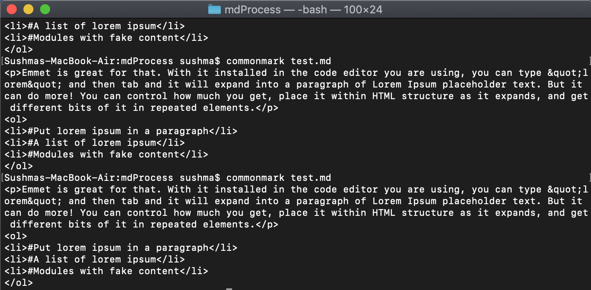
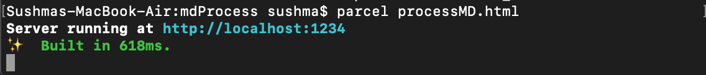
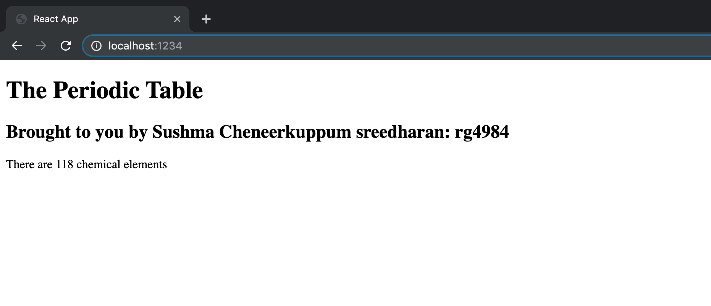

**Student Name**:  Sushma Cheneerkuppum Sreedharan

**NetID**: rg4984

# Homework #4 Solution

## Question 1 

### (a)

Node version: v10.16.3
NPM version: 6.9.0

### (d)



## Question 2 

### (c)



## Question 5

### (a)



```javaScript
import React from "react";
import ReactDOM from "react-dom";
import chemElements from "./elements.json";


ReactDOM.render( <
    h1 > The Periodic Table < /h1>,
    document.getElementById("root")
);
```

```HTML
<!DOCTYPE html>
<html lang="en">

<head>
    <meta charset="utf-8" />
    <link rel="stylesheet" />
    <meta name="viewport" content="width=device-width, initial-scale=1, shrink-to-fit=no" />
    <title>React App</title>
</head>

<body>

    <div id="root"></div>
    <h2>Brought to you by Sushma Cheneerkuppum sreedharan: rg4984</h2>
    <p>There are 118 chemical elements</p>
    <script src="index.js"></script>
</body>

</html>
```