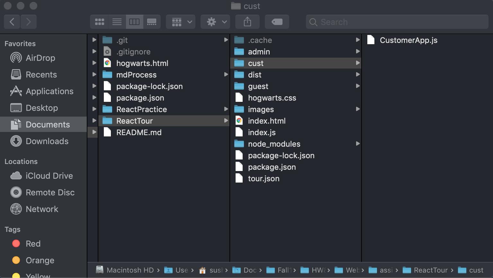
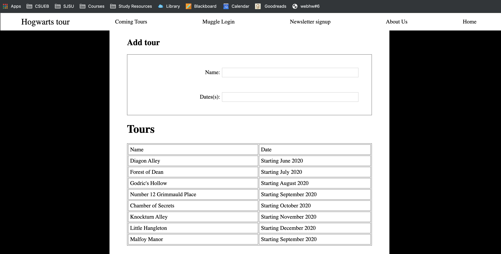
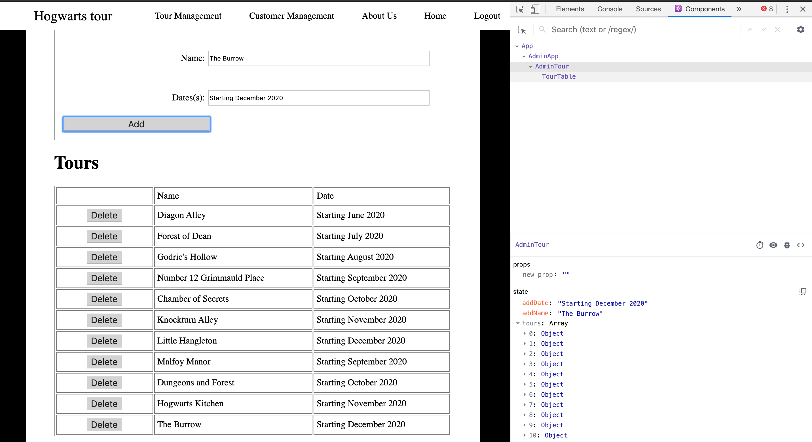
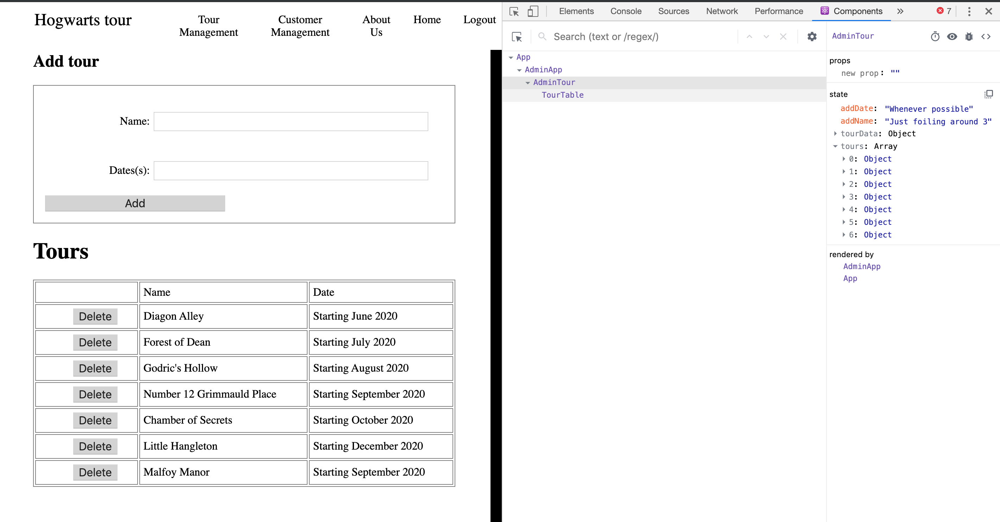
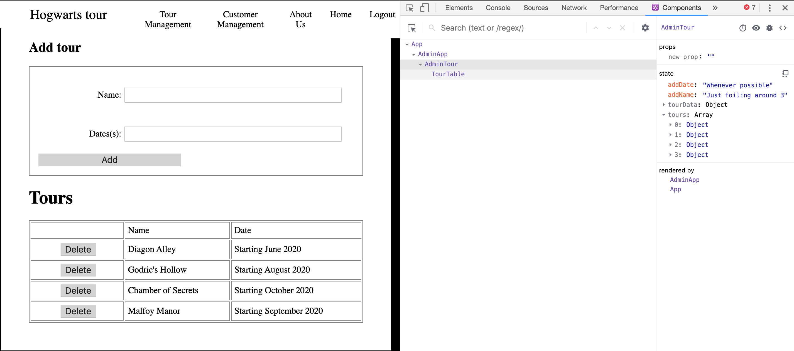
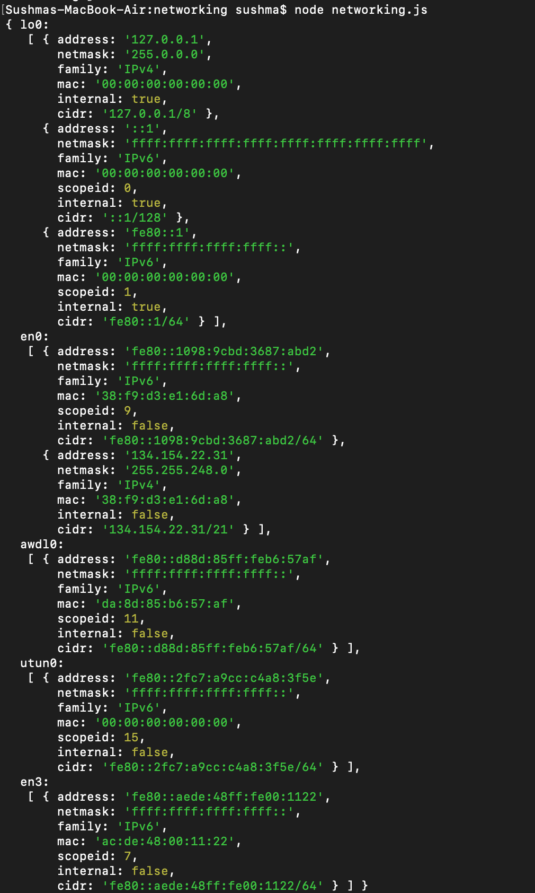
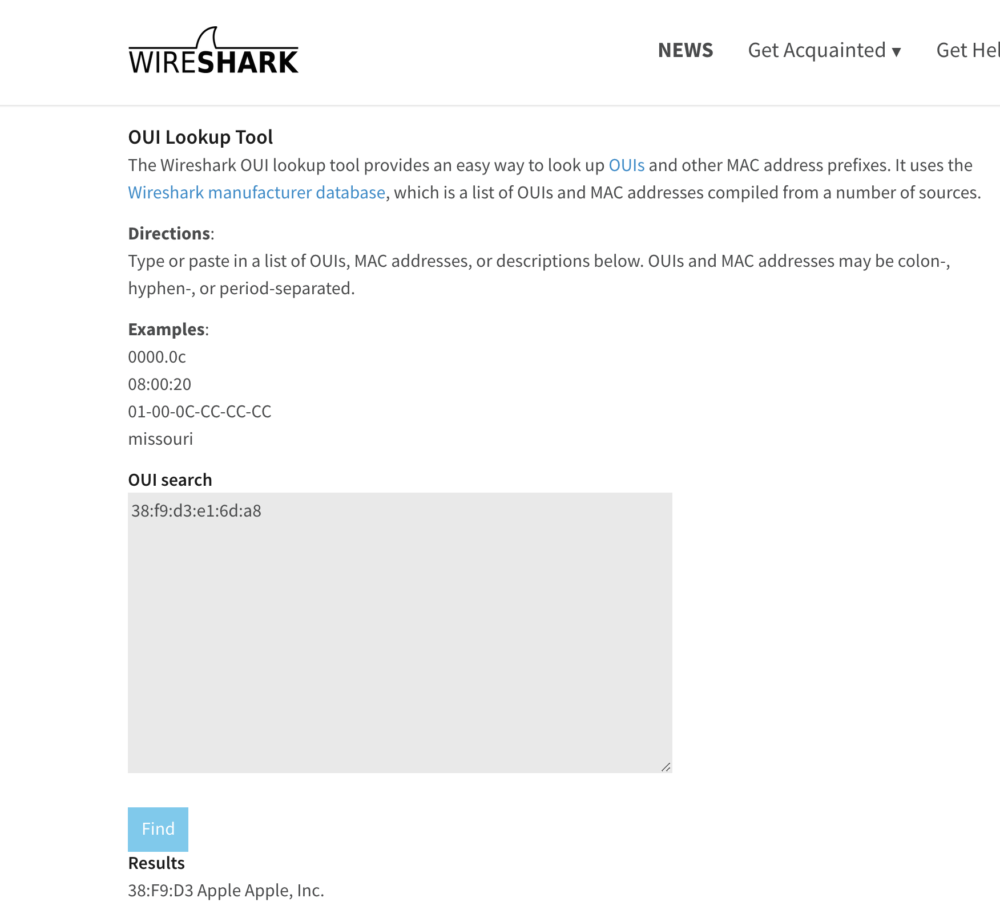

**Student Name**:  Sushma Cheneerkuppum Sreedharan

**NetID**: rg4984

# Homework #6 Solution

## Question 1 

### (a)



### (b)



### (c)

We use a class based component


### (d)
```javascript
class AdminTour extends React.Component {
    constructor(props) {
        super(props); 
        this.state = {
            addName:"Just foiling around 3",
            addDate:"Whenever possible",   
            tours : tourData
            
        }
        
    }
```

### (e)

```javascript

<div><h2>Add tour</h2>
                <form id="add-tour">
  <label>
    Name:
    <input type="text" name="name" value={this.state.addNname} onChange={this.textNameChange.bind(this)}/>
  </label>
  <label>
    Dates(s):
    <input type="text" name="name" value={this.state.addDdate} onChange={this.textDateChange.bind(this)}/>
  </label>
  <button id="login-button" onClick={this.addTour.bind(this)} >Add</button>
</form>
</div>
<TourTable tourData={this.state.tours} />

```

### (f)

```javascript

       addTour(event){
    event.preventDefault();
    console.log();
    this.setState({tours: this.state.tours.concat([{name:this.state.addName, date:this.state.addDate}])})

       }

       textNameChange(event){
       
        this.setState({addName: event.target.value});
           console.log(event.target.value);
           console.log(this.state.addName);
           console.log("input change");
         
      }
      textDateChange(event){
     
        this.setState({addDate: event.target.value});
        console.log(event.target.value);
        console.log("date change");
      } 

```
## Question 1 

### (a)





### (b)
```javascript

function TourTable(props) {
var row = props.tourData.map(function(tourDataRow, i){
return <tr key = {"t" + i} > <td><button id="delete-button" onClick={props.deleteTour.bind(null, i)}>Delete</button></td>
<td>{tourDataRow.name}</td>
<td>{tourDataRow.date}</td></tr>
});

return (
      <div>
        <h1>Tours</h1>
      <table >
      
  <tr><td></td><td id="table-header">Name</td>
    <td>Date</td>
</tr> 


  {row}

    </table>

   </div>
);
}
```

### (c)
```javascript
      deleteTour(index){
         let subTours = {};
         subTours = this.state.tours;
        
        subTours.splice(index,1);
        //  subTours = this.state.tours.filter((i) => index !== i );
          let toursNew = Object.assign({}, this.state.tours, subTours);
          this.setState({tourData: toursNew});
      }  
```

## Question 3

### (a)



### (b)



### (b)

My IPv4 address is '127.0.01' 
It falls under the host category 
Description: Used for loopback addresses to the local host

### (c)

Website: goodreads.com

IP address returned [ '54.239.26.220', '52.94.226.87', '52.94.237.126' ]

### (d)


## Question 4

### (a)

Function this :
In most cases, the value of this is determined by how a function is called. It can’t be set by assignment during execution, and it may be different each time the function is called.

Global context :
In the global execution context (outside of any function), this refers to the global object, whether in strict mode or not.


### (c)

**Output of the code**

Is this the start?
When does this print?
Is this the end?
undefined
this is a msg from CS651
This is a msg from CS351

**Explanation**
 1. The following code prints the first console log statement 'Is this the start?'
 2. it then calls the setTimeout() method which evaluates an expression after a specified number of milliseconds, in the above code cs351 is the function, so it is called and the console.log('This is a msg from CS351'); statement is printed  and this is evaluated immediately because there is no specified number of milliseconds mentioned in the setTimeout method
 3. It prints the next console.log('When does this print?);
 4. It calls the setTimeout method which calls the function CS351, the time interval is O milliseconds, so this is called immediately with no time interval.
 5. It prints the next console.log('Is this the end');

 the setTimeout(cs651); is the same as setTimeout(cs351,0); because the time interval is 0 milliseconds for the second method. 

### (d)

add the following statement :

Promise.race(myPs).then((msg) => console.log(`the winner is ${msg}`));

```javascript
function winner(name) {
  console.log(`The winner is ${name}`);
}
myP1 = new Promise(function(resolve, reject){
    setTimeout(()=>resolve("P1"), 1000*Math.random());
});
myP2 = new Promise(function(resolve, reject){
    setTimeout(()=>resolve("P2"), 1000*Math.random());
});
myP3 = new Promise(function(resolve, reject){
    setTimeout(()=>resolve("P3"), 1000*Math.random());
});
myPs = [myP1, myP2, myP3];
racingPs = Promise.race(myPs);
Promise.race(myPs).then((msg) => console.log(`the winner is ${msg}`));
```

myP1, myP2, myP3 are a promise objects which  represents the eventual completion (or failure) of an asynchronous operation, and its resulting value.

myPs is an array containing all the promises [myP1, myP2, myP3]

The Promise.race(myPs) method returns a promise that resolves or rejects as soon as one of the promises in the iterable resolves or rejects, with the value or reason from that promises.

the above promises call the setTimeout method to resolve the promise and set the time interval to to 1000 millseconds * Math.random()

Math.random() generates a random number

Promise.race(myPs).then((msg)) console logs the winner of the race which is myP1 in the above code snippet