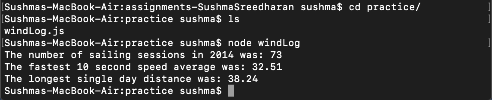
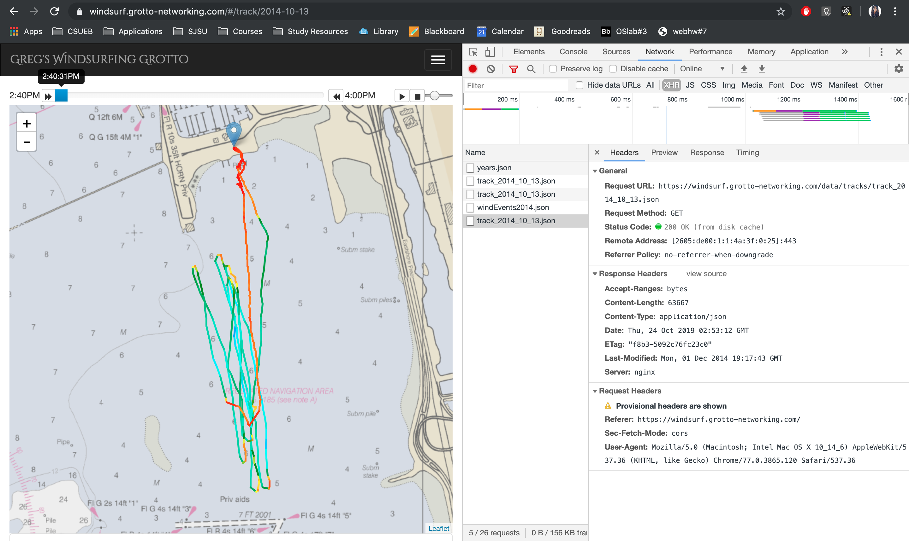
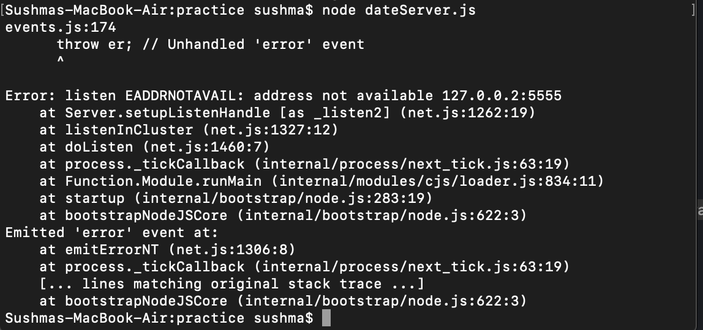
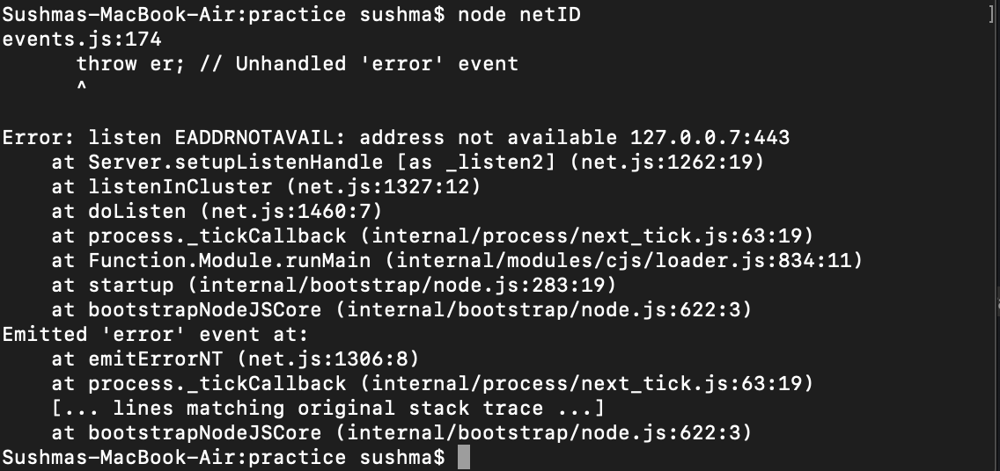
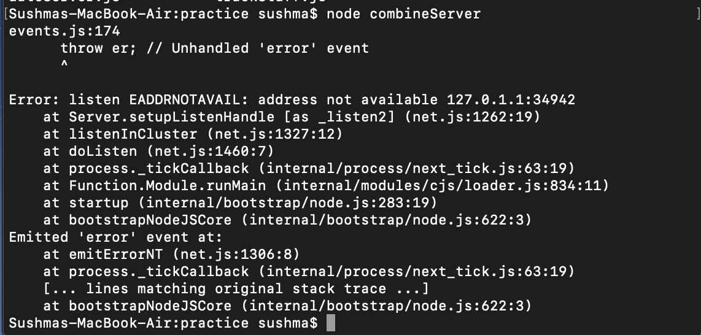

**Student Name**:  Sushma Cheneerkuppum Sreedharan

**NetID**: rg4984

# Homework #7 Solution

## Question 1 

### (a)

Request Method: GET  is used in the request

Response code is 200 - This indicates that the request has succeeded.
 
Version: HTTP/1.1

### (b)

**Request Headers**

Provisional headers are shown

Origin: https://bb.csueastbay.edu  
Referer: https://bb.csueastbay.edu/ui-ultra/css/ultra.css?v=3700.11.0-rel.13+1c185dd  
Sec-Fetch-Mode: cors  
User-Agent: Mozilla/5.0 (Macintosh; Intel Mac OS X 10_14_6) AppleWebKit/537.36 (KHTML, like Gecko) Chrome/ 77.0.3865.120 Safari/537.36

### (c)

**Response Headers**

Accept-Ranges: bytes  
Cache-Control: public  
Content-Length: 20216  
Content-Security-Policy: frame-ancestors 'self'  
Content-Type: font/woff  
Date: Mon, 30 Sep 2019 04:29:44 GMT  
ETag: W/"20216-1568281986000"  
Expires: Wed, 30 Sep 2020 04:29:44 GMT
Last-Modified: Thu, 12 Sep 2019 09:53:06 GMT
P3P: CP="CAO PSA OUR"
Server: openresty/1.9.3.1
X-Frame-Options: SAMEORIGIN

### (d)
Server used by blackboard : openresty/1.9.3.1


### (e)
https://developer.mozilla.org/en-US/docs/Web/JavaScript/Guide/Grammar_and_Types#Comments
protocol: https://
domain: developer.mozilla.org
port:
path: /en-US/docs/Web/JavaScript/Guide/Grammar_and_Types
query:
fragment portions: #Comments

https://www.google.com/search?q=gaia+mission&rlz=1CYPO_enUS751
protocol: https://
domain: www.google.com
port:
path: /search
query: ?q=gaia+mission&rlz=1CYPO_enUS751
fragment portions

http://127.0.0.2:8282/static/index.html
protocol: http://
domain: 127.0.0.2
port: 8282
path: /static/index.html
query:
fragment portions:

## Question 2

### (a)



```javascript
const rp = require('request-promise-native');

let options = {
    uri: 'https://windsurf.grotto-networking.com/data/logs/windEvents2014.json',
    method: 'GET', 
    json: true,
    
};
rp(options)
    .then(function (res) {
        debugger;
    //   console.log(`Grotto status: ${JSON.stringify(res)}`);
     var val,avgSpeed=0,maxDis=0;
     for( val in res){
        avgSpeed= Math.max(res[val].max10sec,avgSpeed);
      maxDis= Math.max(res[val].distance,maxDis);
        }
        console.log(`The number of sailing sessions in 2014 was: ${res.length}` );
        console.log(`The fastest 10 second speed average was: ${avgSpeed}`);
        console.log(`The longest single day distance was: ${maxDis} `);
    });
```
### (b)



### (c)

```javascript
const rp = require('request-promise-native');

let options = {
    uri: 'https://windsurf.grotto-networking.com/data/tracks/track_2014_10_13.json',
    method: 'GET', 
    json: true,
    
};
rp(options)
    .then(function (res) {
        debugger;
        console.log(`The start time of track_2014_1013: ${res.start_time}` );

    });
```


## Question 3
### (a)

```javascript
var express = require('express');

var app = express();
var date = new Date();
port = 5555; 

host = '127.0.0.2'; 
app.get('/date',function(req,res){
  res.send(`Date and time:${date}`);
});

app.listen(port,host,function(){
  console.log(`Date and time app listening on ${host}:${port}`);
});
```

Getting the following error due to mac OS:



### (b)
```javascript
var express = require('express');

var app = express();

port = 443; 

host = '127.0.0.7'; 
app.get('/netID',function(req,res){
  res.send(`Name:Sushma,NetID:rg4984`);
});

app.listen(port,host,function(){
  console.log(`NetID app listening on ${host}:${port}`);
});
```

Getting the following error due to mac OS:



### (c)

Getting the following error due to mac OS:



```javascript
var express = require('express');

var app = express();
var date = new Date();
port = 34942; 

host = '127.0.1.1'; 
app.get('/date',function(req,res){
  res.send(`Date and time:${date}`);
});
app.get('/netID',function(req,res){
    res.send(`Name:Sushma,NetID:rg4984`);
  });

app.listen(port,host,function(){
    console.log(`Combined app listening on ${host}:${port}`);
  });
```