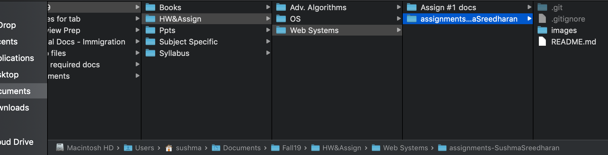
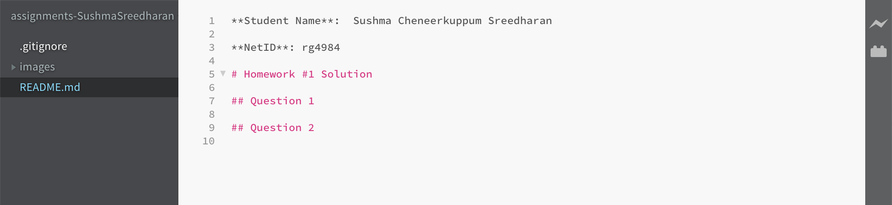
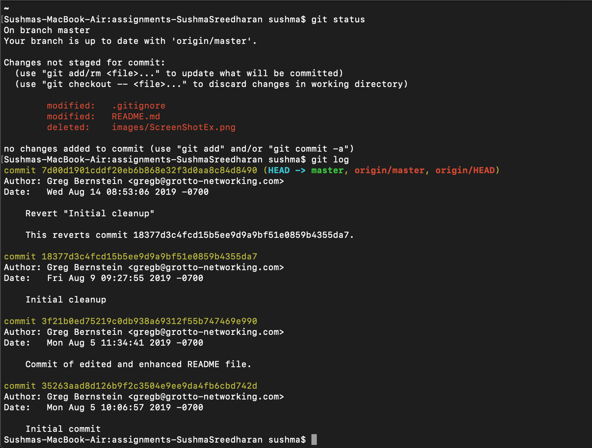
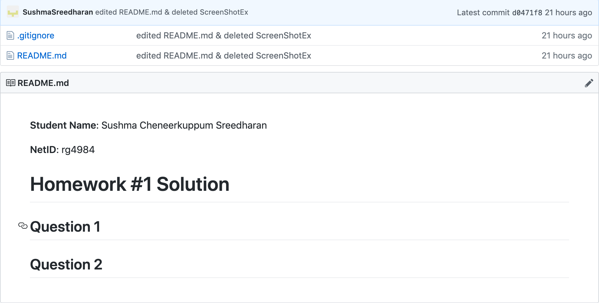

**Student Name**:  Sushma Cheneerkuppum Sreedharan

**NetID**: rg4984

# Homework #1 Solution

## Question 1 

### (a)



### (b)



## Question 2 

### (a)

### (b)



### (c)



## Question 3

### (a)

### (b)

## Question 4

### (a)

1. JavaScript
2. Java
3. C++

### (b)

* Microsoft Windows
* Linux
* macOS
* Android

### (c)

* Visual Studio Code
* Brackets
* Notepad++

## Question 5

### (a) JavaScript Example

```javascript
class Square extends Polygon {
  constructor(length) {
    // Here, it calls the parent class' constructor with lengths
    // provided for the Polygon's width and height
    super(length, length);
    // Note: In derived classes, super() must be called before you
    // can use 'this'. Leaving this out will cause a reference error.
    this.name = 'Square';
  }

  get area() {
    return this.height * this.width;
  }

  set area(value) {
    this.area = value;
  } 
}
```
### (b) Programming Tool: Visual Studio Code

Visual Studio Code is a source-code editor developed by Microsoft for Windows, Linux and macOS. It includes support for debugging, embedded Git control and GitHub, syntax highlighting, intelligent code completion, snippets, and code refactoring.

[Visual Studio Code] (https://code.visualstudio.com/)
