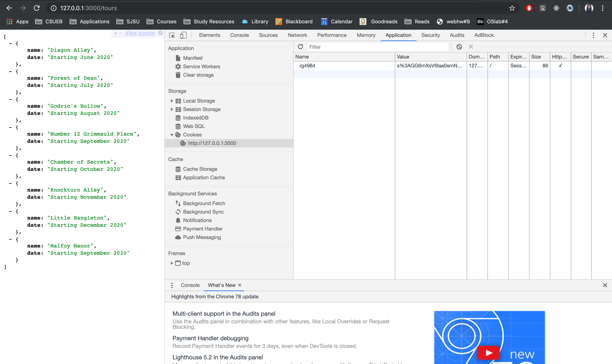
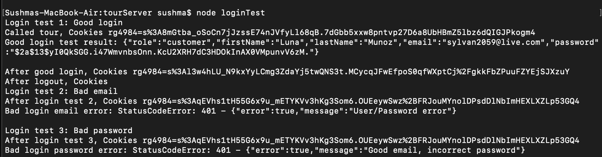
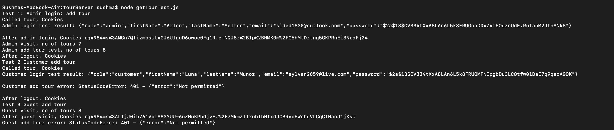

**Student Name**:  Sushma Cheneerkuppum Sreedharan

**NetID**: rg4984

# Homework #9 Solution

## Question 1 

### (a)

```javascript
const DataStore = require('nedb-promises');
const db = DataStore.create(__dirname + '/usersDB');
const users = require('./userTourHash.json');

async function initialize() { // so I can await!
    try {
        let newDocs = await db.insert(users);
        console.log(`Added ${newDocs.length} users`);
    } catch (err) {
        console.log(`Database error: ${err}`);
    }
}

initialize(); // don't forget to run the async function
```

### (b)

```javascript
const DataStore = require('nedb-promises');
const db = DataStore.create(__dirname + '/usersDB');
const users = require('./tour.json');

async function initialize() { // so I can await!
    try {
        let newDocs = await db.insert(users);
        console.log(`Added ${newDocs.length} users`);
    } catch (err) {
        console.log(`Database error: ${err}`);
    }
}

initialize(); // don't forget to run the async function
```

## Question 2

### (a)
```javascript
const db = new DataStore({filename: __dirname + './usersDB', autoload: true});
var tours = require('./tour.json');
app.get('/tours',function(req,res){
  db.insert(tours, function(err, newDocs) {
    if(err) {
      console.log("Something went wrong when writing");
      console.log(err);
    } else {
      console.log("Added " + newDocs.length + " tours");
    }
  });  
  res.send(tours);
});
```

### (b)

```javascript
app.use(express.static('public'));
let urlencodedParser = express.urlencoded({extended: true});
app.post('/tours/add',urlencodedParser,function(req,res){
  var newTour = req.body;
  res.send(tours);
  console.log(newTour);
  tours.push(newTour);
  console.log(tours);

  db.insert([newTour], function(err, newDocs) {
  
    if(err) {
      console.log("Something went wrong when writing");
      console.log(err);
    } else {
      console.log("Added " + newDocs.length + "tours");
    }
  });  
  
});
```

## Question 3

### (a)
```javascript
const cookieName = "rg4984"; // Session ID cookie name, use this to delete cookies too.
app.use(session({
    secret: 'website development CSUEB',
    resave: false,
    saveUninitialized: false,
    name: cookieName // Sets the name of the cookie used by the session middleware
}));

// This initializes session state
const setUpSessionMiddleware = function (req, res, next) {
  console.log(`session object: ${JSON.stringify(req.session)}`);
  console.log(`session id: ${req.session.id}`);
  if (!req.session.user) {
      req.session.user = {role: "guest"};
  };
  next();
};

app.use(setUpSessionMiddleware);
```

### (b)


### (c)

```javascript


app.post('/login',express.json(),function(req,res){
 
 console.log(JSON.stringify(req.body));
  let email = req.body.email;
  let password = req.body.password;
  
  // Find user
  let auser = hashTours.find(function (user) {
      return user.email === email
  });
  if (!auser) {// Not found
      res.status(401).json({error: true, message: "User/Password error"});
      return;
  }
  let verified = bcrypt.compareSync(password, auser.password);
  if (verified) {
    // Upgrade in priveledge, should generate new session id
    // Save old session information if any, create a new session
    let oldInfo = req.session.user;
    console.log(oldInfo);
    req.session.regenerate(function (err) {
        if (err) {console.log(err);}
        let newUserInfo = Object.assign(oldInfo, auser);
        delete newUserInfo.passHash;
        req.session.user = newUserInfo;
        res.json(newUserInfo);
        console.log(newUserInfo);
    });
} else {
      res.status(401).json({error: true, message: "Good email, incorrect password"});
  }
});


```
### (d)

```javascript
app.get('/logout', function (req, res) {
	let options = req.session.cookie;
	req.session.destroy(function (err) {
		if (err) {
			console.log(err);
		}
		res.clearCookie(cookieName, options); // the cookie name and options
		res.json({message: "Goodbye"});
	})
});
```
### (e)



```javascript

const rp = require('request-promise-native');
let cookieJar = rp.jar();

let loginGood = {
uri: 'http://127.0.0.1:3000/login',
json: true,
method: "POST",
body: {"email": "sylvan2059@live.com",
"password": "1wQX_lYt"},

jar:cookieJar
};
let tourInfo = {
    uri: 'http://127.0.0.1:3000/tours',
    json: true,
    method: "GET",
    resolveWithFullResponse: true,
    jar:cookieJar
    };

let loginBadEmail = {
    uri: 'http://127.0.0.1:3000/login',
json: true,
method: "POST",
body: {"email": "sylvan205@live.com",
"password": "1wQX_lYt"},
resolveWithFullResponse: true,
jar:cookieJar
};


let loginBadPass = {
uri: 'http://127.0.0.1:3000/login',
json: true,
method: "POST",
body: {"email": "sylvan2059@live.com",
"password": "2wQX_lYt"}
};
let logout = {
    uri: 'http://127.0.0.1:3000/logout',
    json: true,
    method: "GET",
    jar:cookieJar
    };


async function someTests() {
let res;

try {
console.log("Login test 1: Good login");
await rp(tourInfo);
console.log("Called tour, Cookies " + cookieJar.getCookieString(tourInfo.uri));
}
catch (error) {
    console.log(`Good login error: ${error}\n`);
    }

try {
res = await rp(loginGood);
console.log(`Good login test result: ${JSON.stringify(res)}\n`);
console.log("After good login, Cookies " + cookieJar.getCookieString(loginGood.uri));
} catch (error) {
console.log(`Good login error: ${error}\n`);
}
try {
    res = await rp(logout);
    console.log("After logout, Cookies " + cookieJar.getCookieString(logout.uri));
    } catch (error) {
    console.log(`Good login error: ${error}\n`);
    }
    try {
        console.log("Login test 2: Bad email");
        await rp(tourInfo);
        console.log("After login test 2, Cookies " + cookieJar.getCookieString(tourInfo.uri));
        }
        catch (error) {
            console.log(`Bad login error: ${error}\n`);
            }
        try {
        res = await rp(loginBadEmail);
        console.log(`Test result: ${JSON.stringify(res)}\n`);
        } catch (error) {
        console.log(`Bad login email error: ${error}\n`);
        }
        try {
            console.log("Login test 3: Bad password");
            await rp(tourInfo);
            console.log("After login test 3, Cookies " + cookieJar.getCookieString(tourInfo.uri));
            }
            catch (error) {
                console.log(`Bad password error : ${error}\n`);
                }
            try {
            res = await rp(loginBadPass);
            console.log(`Test result: ${JSON.stringify(res)}\n`);
            } catch (error) {
            console.log(`Bad login password error: ${error}\n`);
            }

    }
someTests();

```

## Question 4

### (a)

```javascript
const checkAdminMiddleware = function (req, res, next) {
    if (req.session.user.role !== "admin") {
        res.status(401).json({error: "Not permitted"});
    } else {
        next();
    }
};
// Only available to admin, returns updated tour list.
app.get('/addTour', checkAdminMiddleware, express.json(), function (req, res) {
  var newTour = req.body;
  res.send(tours);
  console.log(newTour);
  tours.push(newTour);
  
});
```



```javascript
// const rp = require('request-promise-native');

// let options = {
//     uri: 'http://127.0.0.1:3000/tours',
//     method: 'GET', 
//     json: true,
    
// };
// rp(options)
//     .then(function (res) {
//         debugger;let tourNumber=0; let i=0;
//         JSON.stringify(res);
//         for(var val in res)
//         {   
//         tourNumber++;  
//         console.log(`Tour ${tourNumber} name ${res[val].name}, date: ${res[val].date}` );}
//     });


const rp = require('request-promise-native');
let cookieJar = rp.jar();

let addTour = {
uri: 'http://127.0.0.1:3000/addTour',
json: true,
method: "GET",
resolveWithFullResponse:true,
jar:cookieJar
};

let logout = {
    uri: 'http://127.0.0.1:3000/logout',
    json: true,
    method: "GET",
    jar:cookieJar
    };

let loginAdmin = {
    uri: 'http://127.0.0.1:3000/login',
    json: true,
    method: "POST",
    body: {"email": "sylvan2059@live.com",
    "password": "1wQX_lYt"},
    
    jar:cookieJar
    };

let tourInfo = {
    uri: 'http://127.0.0.1:3000/tours',
    json: true,
    method: "GET",
    resolveWithFullResponse: true,
    jar:cookieJar
    };

async function someTests() {
    try {
        console.log("Admin login: add tour");
        await rp(tourInfo);
        console.log("Called tour, Cookies " + cookieJar.getCookieString(tourInfo.uri));
        }
        catch (error) {
            console.log(`Good login error: ${error}\n`);
            }
        
        try {
        res = await rp(loginAdmin);
        console.log(`Admin login test result: ${JSON.stringify(res)}\n`);
        console.log("After admin login, Cookies " + cookieJar.getCookieString(loginAdmin.uri));
        } catch (error) {
        console.log(`Good login error: ${error}\n`);
        }
try {
rp(tourInfo).then(function (res) {

     
        console.log(`Admin visit, no of tours ${(res.body.length)-1}`);
    });
rp(addTour)
    .then(function (res) {
        console.log(`Admin add tour test, no of tours ${res.body.length}`);
    });
}
catch (error) {
    console.log(`Good login error: ${error}\n`);
    }

try {
   await rp(logout);
    console.log("After logout, Cookies " + cookieJar.getCookieString(logout.uri));
    } catch (error) {
    console.log(`Logout error: ${error}\n`);
    }
}
someTests();


```