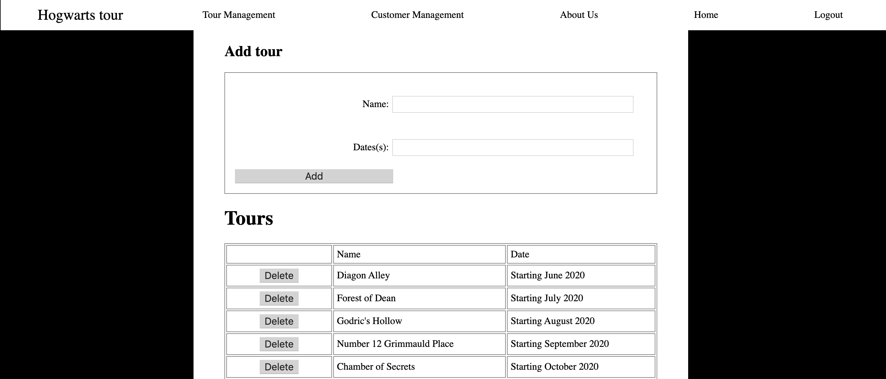

**Student Name**:  Sushma Cheneerkuppum Sreedharan

**NetID**: rg4984

# Homework #6 Solution

## Question 1 

### (a)


### (b)



### (c)

We use a class based component


### (d)
```javascript
class AdminTour extends React.Component {
    constructor(props) {
        super(props); 
        this.state = {
            addName:"Just foiling around 3",
            addDate:"Whenever possible",   
            tours :{
                name:"name",
                date: "name"
            }
        }
        
    }
```

### (e)

```javascript

<form id="add-tour">
  <label>
    Name:
    <input type="text" name="name" value={this.state.addNname} onChange={this.textNameChange.bind(this)}/>
  </label>
  <label>
    Dates(s):
    <input type="text" name="name" value={this.state.addDdate} onChange={this.textDateChange.bind(this)}/>
  </label>
  <button id="login-button" onClick={this.addTour.bind(this)} >Add</button>
</form>
</div>
<TourTable tourData={tourData} tours={this.state.tours} />
</div>

```

### (f)

```javascript

   addTour(event){
    event.preventDefault();
    this.setState({tours: {name: this.state.addName, date: this.state.addDate}});
    event.preventDefault();
    console.log();
    tourData.push({"name": this.state.addName, "date": this.state.addDate});

       }

       textNameChange(event){
       
        this.setState({addName: event.target.value});
           console.log(event.target.value);
           console.log(this.state.addName);
           console.log("input change");
         
      }
      textDateChange(event){
     
        this.setState({addDate: event.target.value});
        console.log(event.target.value);
        console.log("date change");
      }  

```
