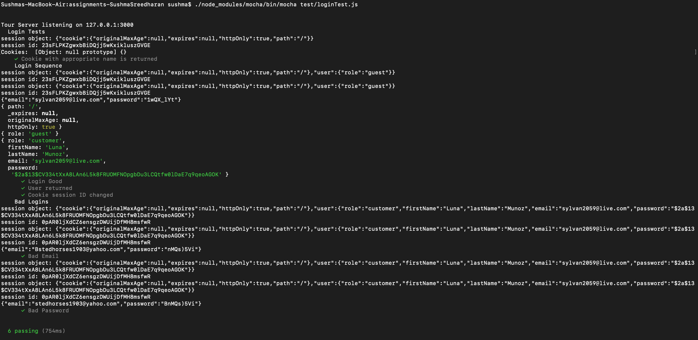
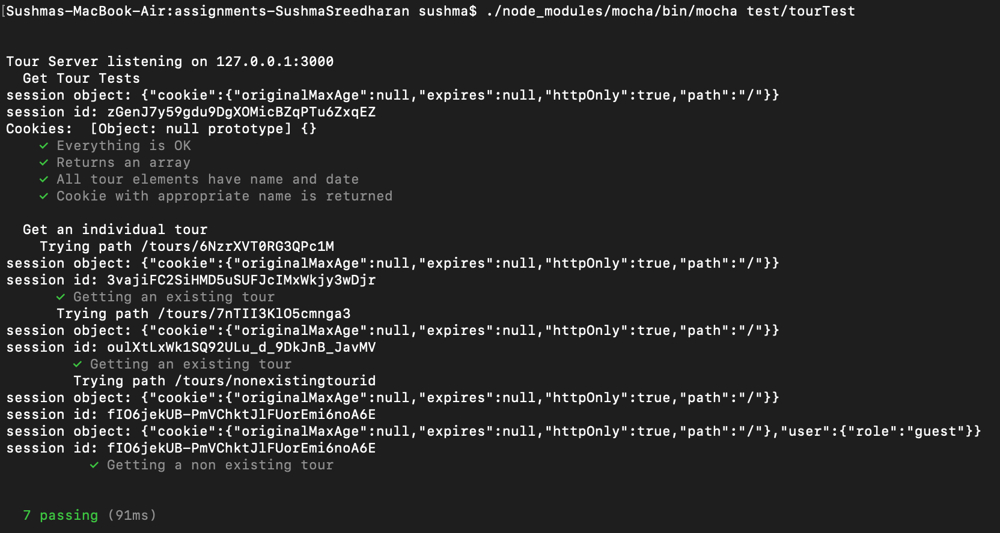

**Student Name**:  Sushma Cheneerkuppum Sreedharan

**NetID**: rg4984

# Homework #10 Solution

## Question 1 

### (a)

**See all tours**

Path: http://hogwarts.tour.com/tour-management/toursInfo

Roles: Guest, Customer, Admin

Method: GET

Success: OK (200)
Error: NOT FOUND (404), BAD REQUEST (400)

### (b)
**Get info on a specific tour**

Path: http://hogwarts.tour.com/tour-management/toursInfo/{tour-id}

Roles: Guest, Customer, Admin

Method: GET

Success: OK (200)
Error: NOT FOUND (404), BAD REQUEST (400)

### (c)
**Add a new tour**

Path: http://hogwarts.tour.com/tour-management/admin/addTour/{tour-id}

Roles: Admin

Method: POST

Success: CREATED (201)
Error:  204 (No Content)

### (d)
**Edit a tour**

Path: http://hogwarts.tour.com/tour-management/admin/editTour/{tour-id}

Roles: Admin

Method: PUT

Success: 201 (Created)
Error: 204 (No Content) 


### (e)
**Delete a tour**

Path: http://hogwarts.tour.com/tour-management/admin/deleteTour/{tour-id}

Roles: Admin

Method: DELETE

Success: 202 (Accepted)
Error: 404 (NOT FOUND) 

## Question 2

### (a) Allow a user to see all the tours they are signed up for

Path: http://hogwarts.tour.com/tour-management/users/{id}/toursInfo

### (b) Allow a user to signup

Path: http://hogwarts.tour.com/tour-management/users/{id}/signup

### (c) Allow a user to remove themselves

Path: http://hogwarts.tour.com/tour-management/users/{id}/removeUser

### (d) Get all the customers signed up on a particular tour

Path: http://hogwarts.tour.com/tour-management/customer/{id}/signup/tourInfo/{tour-id}


## Question 3

### (a)


### (b)




## Question 4

### (a)



```javascript
const app = require('../tourServer');
const assert = require('chai').assert;
const request = require('supertest'); 
const cookie = require('cookie');


describe('Get Tour Tests', function () {
	let response;
	let tours = null;
	before(async function(){
		response = await request(app).get('/tours');
	})
	it('Everything is OK', async function(){
		assert.equal(response.status, 200);
	});
	it('Returns an array', function(){
		tours = JSON.parse(response.text);
		assert.isArray(tours);
	});
	it('All tour elements have name and date', function(){
		tours.forEach(function(tour){
			assert.containsAllKeys(tour, ['name', 'date']);
		});
	});
	it('Cookie with appropriate name is returned', function(){
		let cookies = response.header['set-cookie'].map(cookie.parse);
		let mycookie = cookies.filter(c => c.hasOwnProperty('rg4984'));
		assert.notEmpty(mycookie);
	});
})

describe('Get an individual tour', function () {
	describe('Trying path /tours/6NzrXVT0RG3QPc1M', function () {
	let response;
	let tours = null;
	before(async function(){
		response = await request(app).get('/tours/6NzrXVT0RG3QPc1M');
	})
	it('Getting an existing tour ', async function(){
		assert.equal(response.status, 200);
	});

	describe('Trying path /tours/7nTII3KlO5cmnga3', function () {
	let response;
	before(async function(){
		response = await request(app).get('/tours/7nTII3KlO5cmnga3');
	})
	it('Getting an existing tour ', async function(){
		assert.equal(response.status, 200);
	});
	describe('Trying path /tours/nonexistingtourid', function () {
		let response;
		let tours = null;
		before(async function(){
			response = await request(app).get('/tours/nonexistingtourid');
		})
		it('Getting an existing tour ', async function(){
			assert.equal(response.status, 404);
		});
	})
})
})
})

```