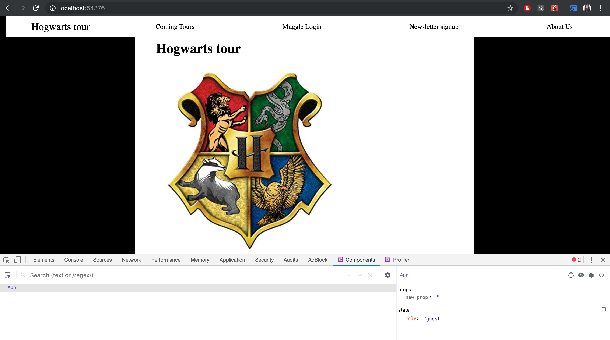

**Student Name**:  Sushma Cheneerkuppum Sreedharan

**NetID**: rg4984

# Homework #5 Solution

## Question 1 

### (a)

### (b)



### (c)


### (d)

```javascript

class App extends React.Component {
    constructor(props) {
        super(props);
        this.state = {
            role: "guest"
        }; // We will have "user" and "admin" roles too.
    }
   
    render() {
        let contents = null;
        switch (this.state.role) {
            case "guest":
                contents = <GuestApp />;
                break;
            case "customer":
                contents = <CustomerApp />;
                break;
            case "admin":
                contents = <AdminApp />;
                break;
            default:
                contents = <h2>Warning something went wrong!!!</h2>;
        }
        
        return (
            <div>
                {contents}

<body>
     <main>
       <h1>Hogwarts tour</h1>
        <h2> 
         </h2>
         <h3>Draco dormiens nunquam titillandus</h3>


         <section class="hogwarts-intro">

             <h1>
     

             </h1>
             <p>Hogwarts is in Scotland. The school is depicted as having numerous charms and spells on and around it that make it impossible for a Muggle to locate it. Muggles cannot see the school; rather, they see only ruins and several warnings of danger. The castle's setting is described as having extensive grounds with sloping lawns, flowerbeds and vegetable patches, a loch (called The Black Lake), a large dense forest (called the Forbidden Forest), several greenhouses and other outbuildings, and a full-size Quidditch pitch. There is also an owlery, which houses all the owls owned by the school and those owned by students. Some rooms in the school tend to "move around", and so do the stairs in the grand staircase. Witches and wizards cannot Apparate or Disapparate in Hogwarts grounds, except when the Headmaster lifts the enchantment, whether only in certain areas or for the entire campus, so as to make the school less vulnerable when it serves the headmaster to allow Apparition. Electricity and electronic devices are not found at Hogwarts. In Harry Potter and the Goblet of Fire, Hermione indicates that due to the high levels of magic, "substitutes for magic (that) Muggles use" such as computers, radar and electricity "go haywire" around Hogwarts. Radios however, make an exception. Rowling explains this by saying that the radios are not powered by electricity but by magic.</p>
         </section>
     </main>
</body>
            </div>

         );
    }
}
ReactDOM.render(<App />, document.getElementById("root"));

```

## Question 2 


### (b)


```javascript
class GuestApp extends React.Component {
    constructor(props) {
        super(props); // Must call
        // Set up state here
        this.state = {
                showing: "home"
        };
    }
    handleHomeClick(event) {
        console.log(event);
        console.log(event.target)
        console.log("You pressed a button");
        this.setState({showing: "home"});
    }
    handleAboutClick(event) {
        console.log(event);
        console.log(event.target)
        console.log("You pressed a button");
        this.setState({showing: "about"});
    }
    handleLoginClick(event) {
        console.log(event);
        console.log(event.target)
        console.log("You pressed a button");
        this.setState({showing: "login"});
    }
    
  
    // Renders component based on current state and props
    render() {
        let contents = null;
        switch (this.state.showing) {
            case "home":
                contents = <Home />;
                break;
            case "about":
                contents = <About />;
                break;
            case "login":
                contents = <h1>Not implemented yet!</h1>;
                break;
            default:
                contents = <h2>Warning something went wrong!!!</h2>;
        }

        let navbar = <header>
        <nav className="nav-container">
        <span className="CoName">Hogwarts tour</span>
            <ul>
                <li><a href="#">Coming Tours</a></li>
                <li><a onClick={this.handleLoginClick.bind(this)}>Muggle Login</a></li>
                <li><a href="signup.html">Newsletter signup</a></li>
                <li><a onClick={this.handleAboutClick.bind(this)}>About Us</a></li>
                <li><a onClick={this.handleHomeClick.bind(this)}>Home</a></li>
            </ul>

        </nav>

    </header>;
       
        return (
            <div>
            {navbar}
            <body>
            <main>
            {contents}
            </main></body>

    </div> 
    
        );
    }
}
export default GuestApp;
```
```javascript
class Home extends React.Component {
    constructor(props) {
        super(props); // Must call
        // Set up state here
        this.state = {
                showing: "home"
        };
    }
    // Renders component based on current state and props
    render() {
        // Any code you like
        return (
        <div>
<body>
<main>
<h1>Hogwarts tour</h1>
<h2> 
 </h2>
 <h3>Draco dormiens nunquam titillandus</h3>


 <section class="hogwarts-intro">

     <h1>


     </h1>
     <p>Hogwarts is in Scotland. The school is depicted as having numerous charms and spells on and around it that make it impossible for a Muggle to locate it. Muggles cannot see the school; rather, they see only ruins and several warnings of danger. The castle's setting is described as having extensive grounds with sloping lawns, flowerbeds and vegetable patches, a loch (called The Black Lake), a large dense forest (called the Forbidden Forest), several greenhouses and other outbuildings, and a full-size Quidditch pitch. There is also an owlery, which houses all the owls owned by the school and those owned by students. Some rooms in the school tend to "move around", and so do the stairs in the grand staircase. Witches and wizards cannot Apparate or Disapparate in Hogwarts grounds, except when the Headmaster lifts the enchantment, whether only in certain areas or for the entire campus, so as to make the school less vulnerable when it serves the headmaster to allow Apparition. Electricity and electronic devices are not found at Hogwarts. In Harry Potter and the Goblet of Fire, Hermione indicates that due to the high levels of magic, "substitutes for magic (that) Muggles use" such as computers, radar and electricity "go haywire" around Hogwarts. Radios however, make an exception. Rowling explains this by saying that the radios are not powered by electricity but by magic.</p>
 </section>
</main>
</body> 
    </div>
        );

    }
}
export default Home;
```

```javascript
class About extends React.Component {
    constructor(props) {
        super(props); // Must call
        // Set up state here
    }

    // Renders component based on current state and props
    render() {
        return (
            <div>
<body>
<main>
<h1>About Hogwarts Tours</h1>

 <h3>Hogwarts Tours is a fictional tour company created to teach various aspects of magic</h3>


 <section class="hogwarts-intro">

     <p>
       
         <h3>Core</h3>
     <ol>
                <li>Astronomy</li>
                <li>Charms</li>
                <li>Defence Against the dark arts</li>
                <li>Herbology</li>
                <li>History of Magic</li>
            </ol>
            <h3>Optional</h3>
            <ol>
                <li>Care of Magical Creaters</li>
                <li>Muggle studies</li>
            </ol>
            <h3>Extra Curriclur</h3>
            <ol>
                <li>Quidditch</li>
                <li>Earth Magic</li>
            </ol>

     </p>
 </section>
</main>
</body> 
    </div>
        );
    }
}
export default About;

```